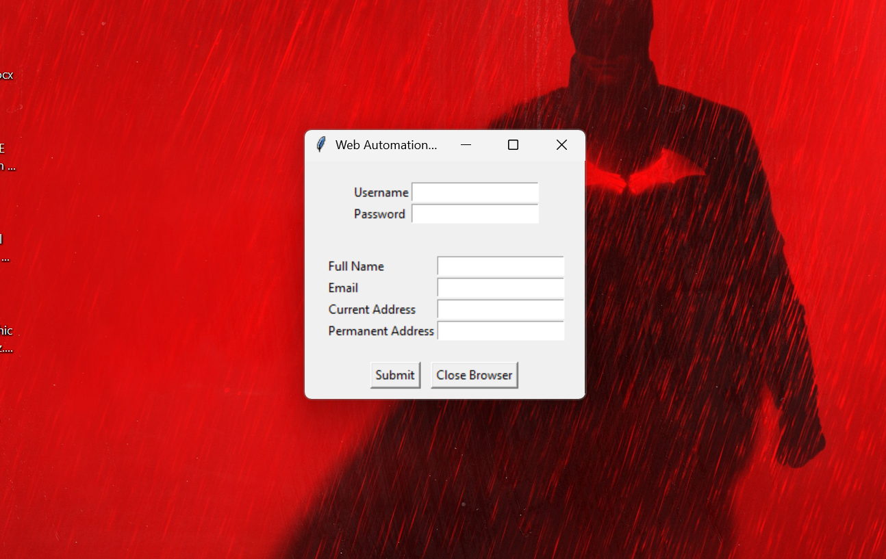

# 🧠 Web Automation GUI using Selenium + Tkinter

A Python-based **GUI automation tool** that combines the power of **Selenium WebDriver** with an easy-to-use **Tkinter interface**.  
Users can log in, fill forms, and download files from websites — all through a simple desktop interface.

---

## 🖼️ Screenshot Preview




---

## 🚀 Features

- 🖥️ **Graphical User Interface** built with Tkinter  
- 🔐 Secure login automation using Selenium  
- 🧭 Form auto-fill and submission  
- 📥 File download capability  
- ⚙️ Chrome browser configuration (custom paths, headless mode ready)  
- 💬 Popup notifications for user feedback  

---

## 🧩 Tech Stack

| Component | Technology |
|------------|-------------|
| GUI | Tkinter |
| Browser Automation | Selenium WebDriver |
| Environment Variables | python-dotenv |
| Language | Python 3.x |
| Browser | Google Chrome |

---

## 📂 Project Structure

```
browser-automation/
│
├── chromedriver-win64/          # ChromeDriver executable
├── main.py                      # Core Selenium automation script
├── gui_app.py                   # Tkinter GUI that uses WebAutomation class
├── .env                         # Stores credentials (not pushed to GitHub)
├── screenshots/                 # Folder for GUI or workflow screenshots
└── README.md                    # Project documentation
```

---

## ⚙️ Setup Instructions

### 1️⃣ Clone this Repository
```bash
git clone https://github.com/<your-username>/browser-automation.git
cd browser-automation
```

### 2️⃣ Create a Virtual Environment
```bash
python -m venv venv
venv\Scripts\activate  # On Windows
source venv/bin/activate  # On Mac/Linux
```

### 3️⃣ Install Dependencies
```bash
pip install selenium python-dotenv
```

### 4️⃣ Set Up .env File
Create a `.env` file in your project root:
```
USERNAME=your_username
PASSWORD=your_password
```

> ⚠️ **Never commit your `.env` file** — add it to `.gitignore` to keep credentials safe.

### 5️⃣ Download ChromeDriver
- Download the matching **ChromeDriver** version for your Chrome browser:  
  👉 https://chromedriver.chromium.org/downloads  
- Extract it into `chromedriver-win64/`  
- Update the path in `main.py` if necessary:
  ```python
  service = Service('chromedriver-win64/chromedriver.exe')
  ```

---

## ▶️ Run the Applications

### 🧠 Option 1: Command Line Automation
```bash
python main.py
```

### 🖥️ Option 2: GUI Version
```bash
python gui_app.py
```

Then:
1. Enter login credentials  
2. Fill in form details  
3. Click **Submit**  
4. Optionally click **Close Browser** once done  

---

## 🧠 Learning Outcomes

- Build a desktop GUI integrated with browser automation  
- Manage Selenium sessions inside a user interface  
- Work with WebDriverWait, ExpectedConditions, and DOM elements  
- Use `.env` for secure credential storage  
- Create reusable OOP structures for automation  

---

## 💡 Future Improvements

- ✅ Add Headless mode toggle  
- ✅ Include screenshots and logging  
- 🧵 Run Selenium tasks in a separate thread (non-blocking GUI)  
- 📁 Allow users to choose download paths dynamically  

---

## ✨ Author

**Lakshya Birla**  
🔗 [GitHub Profile](https://github.com/<your-username>)  
💼 Passionate about building intelligent automation tools that bridge humans and machines.
